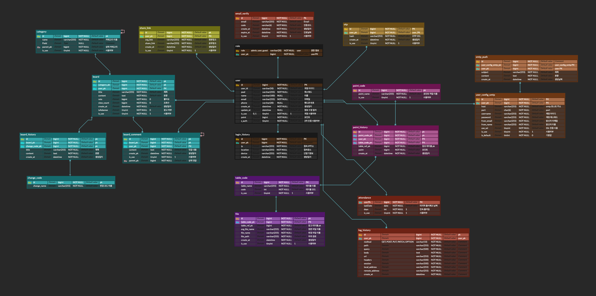

# Project Anamensis


## ERD --> [Link](https://www.erdcloud.com/d/kaLkfNKiwKcPe85k4)



## JKS 인증키 생성 방법
```shell
keytool -genkeypair -alias 'alias' -keyalg RSA \
-dname "CN=Web Server,OU=Unit,O=Organization,L=City,S=State,C=US" \
-keypass 'secret' -keystore 'file.jks' -storepass 'password'
```

## docker create secret
- application.yml 파일을 secret으로 등록
```shell

docker secret create server_anamensis_secret_config application.yml
docker secret create batch_anamensis_secret_config application.yml
docker secret create config_anamensis_secret_config application.yml
docker secret create config_anamensis_secret_keystore anamensis.jks

```

## docker create network
- anamensis 전용 네트워크 생성
```shell
docker network create anamensis --scope swarm
```

## docker build & deploy
- docker build & deploy
- buildtype : server, batch, config, nextjs
```shell
#build
/root/build.sh build_type version docker_hub_id

#deploy
/root/deploy.sh deploy_type version port docker_hub_id
```
- example build & deploy
```shell
#build
./build.sh server 1.0.0 anamensis

#deploy
./deploy.sh server 1.0.0 8080 anamensis
```