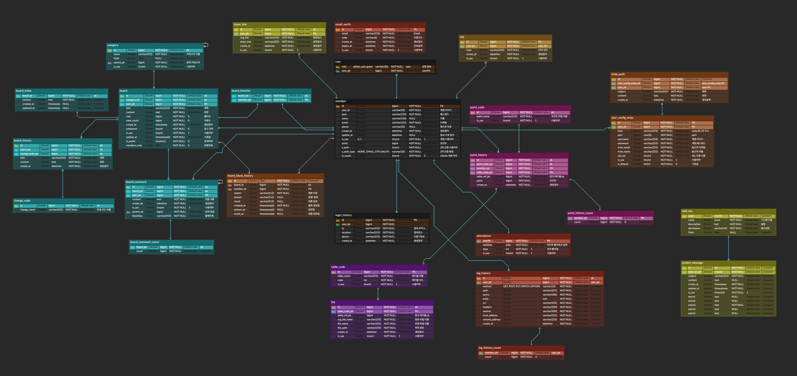

# Project Anamensis


## ERD --> [Link](https://www.erdcloud.com/d/kaLkfNKiwKcPe85k4)


## docker create secret
- application.yml 파일 및 nextjs.env secret으로 등록

```shell
docker secret create config_anamensis_secret_config config-config.yml
docker secret create config_anamensis_secret_keystore keystore.jks
docker secret create batch_anamensis_secret_config batch-config.yml
docker secret create nextjs_anamensis_secret_config nextjs.env
```

## docker build
- docker build & deploy
- service : site(nextjs + server), batch, config, base
- port : service port
- docker_hub_id : docker hub id 혹은 docker registry id
- base_id : docker build base Docker Image
```shell
#build, site, batch, config
/root/build.sh service version docker_hub_id base_id

#build base
/root/build.sh base version docker_hub_id

```
- example build & deploy
```shell
#site build
./build.sh site 0.0.40 anamensis anamensis

#base build
/root/build.sh base 0.0.1 anamensis
```

## nextjs environments
- NEXTAUTH_SECRET (필수값)
- NEXT_PUBLIC_CDN_SERVER (기본값: http://localhost:3000/files)
- NEXT_PUBLIC_BASE_URL (기본값: http://localhost:3000)
- OATH2 설정
  - GOOGLE_CLIENT_ID (선택값)
  - GOOGLE_CLIENT_SECRET (선택값) 
  - KAKAO_CLIENT_ID (선택값)
  - KAKAO_CLIENT_SECRET (선택값)
  - GITHUB_CLIENT_ID (선택값)
  - GITHUB_CLIENT_SECRET (선택값)
  - NAVER_CLIENT_ID (선택값)
  - NAVER_CLIENT_SECRET (선택값)
- CUSTOM OAUTH2 설정
  - CUSTOM_CLIENT_ID (선택값)
  - CUSTOM_CLIENT_SECRET (선택값)
  - CUSTOM_OAUTH2_SERVER_URL (선택값)

## Spring Server environments
- TIME_ZONE (기본값: Asia/Seoul)
- DB_URI (필수, 기본값: localhost:5432/anamensis)
- DB_USERNAME (필수값: postgres)
- DB_PASSWORD (필수값)
- DB_MAX_POOL_SIZE (기본값: 21)
- JWT_SECRET_KEY (필수값)
- FILE_STORAGE_DIR (기본값: /)
- AWS 설정
  - AWS_S3_ACTIVE (기본값: false)
  - AWS_ACCESS_KEY  (AWS 설정 시 필수값, 기본값 없음)
  - AWS_SECRET_KEY (AWS 설정 시 필수값, 기본값 없음)
  - AWS_REGION (기본값: ap-northeast-2)
  - AWS_BUCKET (기본값: anamensis)


## example site nextjs.env
- [KaKao Login](https://developers.kakao.com/product/kakaoLogin)
- [Google OAuth](https://cloud.google.com/apigee/docs/api-platform/security/oauth/oauth-home?hl=ko)
- [Github OAuth](https://docs.github.com/ko/apps/oauth-apps/building-oauth-apps/authorizing-oauth-apps)
- [Naver OAuth](https://developers.naver.com/docs/login/api/api.md)

